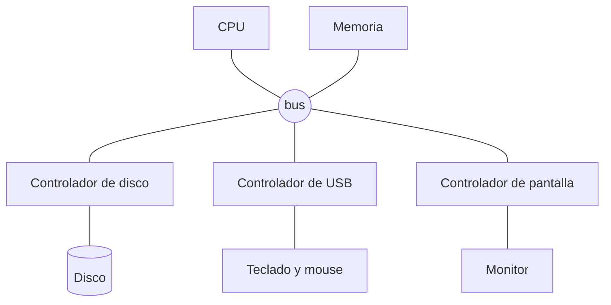
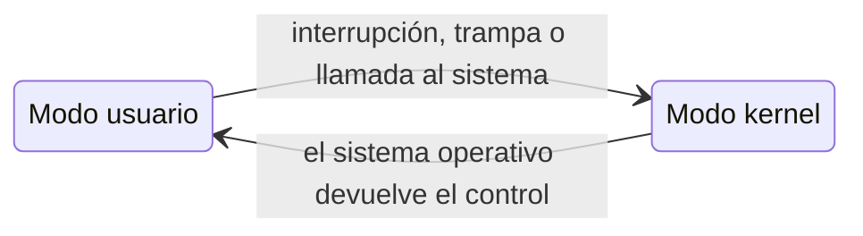

Un sistema operativo está hecho a la medida del hardware que administra. No hace falta saber de circuitos, pero sí entender cuatro ideas: cómo se comunican las piezas, cómo avisan que terminaron algo, por qué hay tantos tipos de memoria y cómo el hardware ayuda a que nadie se salte las reglas.

## Las piezas y cómo se hablan



- La **CPU** ejecuta instrucciones. Tiene **registros**, pequeñas memorias ultrarrápidas donde deben estar los datos para operar con ellos, y un **contador de programa** que apunta a la siguiente instrucción. Su velocidad se marca con un reloj, en ciclos por segundo (GHz), y hoy casi siempre trae varios **núcleos**.
- La **memoria principal** (RAM) guarda los programas en ejecución y sus datos. La CPU puede leer cualquier posición directamente, pero se borra al apagar el equipo.
- Cada **dispositivo** tiene un **controlador**: un pequeño circuito con su propio búfer de memoria, que sabe manejar ese tipo de dispositivo.
- En el sistema operativo, cada controlador tiene su **driver** (manejador de dispositivo): el software que sabe hablarle.

La CPU y los dispositivos trabajan **al mismo tiempo**. La CPU le pide algo a un controlador, por ejemplo "lee este bloque del disco", y sigue con otras cosas mientras el controlador trabaja. La pregunta es: ¿cómo se entera la CPU de que el disco terminó?

## Preguntar o esperar el aviso

Hay dos formas:

- **Sondeo (*polling*):** la CPU pregunta cada cierto tiempo "¿ya terminaste?". Es como mirar el teléfono cada dos minutos por si llegó un mensaje: se pierde mucho tiempo preguntando.
- **Interrupciones:** el dispositivo avisa cuando termina, enviando una señal a la CPU. Es el teléfono que suena.

### Cómo se atiende una interrupción

1. El controlador envía una **señal de interrupción** a la CPU.
2. La CPU termina la instrucción que estaba ejecutando y **guarda su estado**: por dónde iba y el contenido de sus registros.
3. Busca en el **vector de interrupciones**, una tabla que dice qué rutina atiende cada tipo de interrupción, y salta a esa **rutina de servicio**, que es parte del sistema operativo.
4. La rutina hace lo necesario (por ejemplo, anotar que los datos del disco están listos).
5. La CPU **restaura el estado** guardado y sigue exactamente donde estaba, como si nada.

Mientras se atiende una interrupción importante, otras pueden quedar **enmascaradas** (en espera), para no perderlas ni mezclarlas.

Además de las interrupciones de hardware, están las **trampas** o **excepciones**: interrupciones generadas por software. Ocurren por un error (una división por cero, acceder a memoria prohibida) o porque un programa **pide un servicio** al sistema operativo, que es justamente cómo funcionan las llamadas al sistema.

Un sistema operativo moderno pasa la mayor parte del tiempo **esperando interrupciones**: se dice que está conducido por interrupciones (*interrupt driven*). En Linux puedes ver cuántas ha atendido cada núcleo:

```bash
cat /proc/interrupts
```

## Entrada y salida

### Sincrónica y asincrónica

- **E/S sincrónica:** el programa pide la operación y **se queda esperando** a que termine para seguir.
- **E/S asincrónica:** el programa pide la operación y **sigue trabajando**; más tarde se entera de que terminó.

En ambos casos, el sistema operativo lleva una tabla con el estado de cada dispositivo y de las solicitudes pendientes sobre él.

### Acceso directo a memoria (DMA)

Si un dispositivo rápido interrumpiera a la CPU por **cada byte** que transfiere, la CPU no haría otra cosa. Con **DMA** (*Direct Memory Access*), el controlador copia **bloques completos** directamente a la memoria principal, sin pasar por la CPU, y genera **una sola interrupción** al terminar el bloque.

Hoy todos los dispositivos rápidos (discos NVMe, tarjetas de red, tarjetas de video) usan DMA.



## La jerarquía de memoria

¿Por qué no hacer toda la memoria de un solo tipo? Porque no existe una memoria que sea a la vez rapidísima, enorme, barata y que no se borre al apagar. Así que se combinan varias, en una **jerarquía**:

```mermaid La jerarquía de memoria: arriba lo más rápido y caro, abajo lo más lento y barato
flowchart TD
    R[Registros de la CPU] --> C["Caché L1, L2, L3<br/>dentro del procesador"]
    C --> RAM["Memoria principal (RAM)<br/>se borra al apagar"]
    RAM --> SSD["SSD / NVMe<br/>no se borra al apagar"]
    SSD --> HDD[Disco duro]
    HDD --> CI[Cinta, almacenamiento en la nube]
```

- La **memoria principal** es lo más lento a lo que la CPU puede acceder directamente.
- El **almacenamiento secundario** (SSD, discos) guarda grandes cantidades de datos de forma permanente y barata, pero es mucho más lento.
- El **almacenamiento terciario** (cintas, respaldos en la nube) es para archivar: enorme, barato y lento.

### ¿Qué tan distintos son?

Las diferencias de velocidad son tan grandes que cuesta imaginarlas. Esta simulación usa tiempos aproximados y los estira: **si un nanosegundo durara un segundo**, ¿cuánto tardaría cada acceso?

```php
<?php
declare(strict_types=1);

// Tiempos aproximados de acceso, en nanosegundos (lo que importa es el orden de magnitud)
$latencias = [
    'Registro de la CPU'               => 0.3,
    'Caché L1'                         => 1,
    'Caché L2'                         => 4,
    'Caché L3'                         => 15,
    'Memoria RAM'                      => 100,
    'SSD NVMe (leer un bloque)'        => 20_000,
    'SSD SATA (leer un bloque)'        => 100_000,
    'Disco duro (buscar y leer)'       => 5_000_000,
    'Paquete Santiago-EE.UU. y vuelta' => 150_000_000,
];

// ¿Y si un nanosegundo durara un segundo?
function aEscalaHumana(float $segundos): string
{
    return match (true) {
        $segundos < 60         => sprintf('%.1f segundos', $segundos),
        $segundos < 3_600      => sprintf('%.1f minutos', $segundos / 60),
        $segundos < 86_400     => sprintf('%.1f horas', $segundos / 3_600),
        $segundos < 31_536_000 => sprintf('%.1f días', $segundos / 86_400),
        default                => sprintf('%.1f años', $segundos / 31_536_000),
    };
}

foreach ($latencias as $nivel => $nanosegundos) {
    echo mb_str_pad($nivel, 34), aEscalaHumana($nanosegundos), PHP_EOL;
}
```

Si leer de la caché fuera tomar un papel del escritorio, leer de un disco duro sería esperar casi dos meses. Por eso el sistema operativo hace todo lo posible por **no ir al disco**.

### Caché: tener a mano lo que se va a usar

Una **caché** es una memoria más rápida que guarda **copias** de datos que se usaron hace poco, apostando a que se van a volver a usar pronto. La idea se repite en cada nivel de la jerarquía:

- La caché del procesador guarda datos de la RAM.
- La RAM funciona como caché del disco: Linux usa la memoria libre para guardar archivos leídos recientemente (por eso `free -h` muestra memoria "en caché").
- El navegador guarda en disco copias de páginas que ya visitaste.

El problema de tener copias es la **consistencia**: si un dato cambia en un nivel, las copias de los otros niveles tienen que actualizarse.

### Búfer y spooling

- Un **búfer** es memoria temporal que guarda datos **mientras se transfieren** entre dos partes que van a distinta velocidad, o que manejan bloques de distinto tamaño.
- El **spooling** usa el disco como búfer entre un proceso y un dispositivo lento, como la [cola de impresión](/archivo/sistemas-operativos/teoria/que-es-un-sistema-operativo.md#los-40-y-50-la-maquina-desnuda-y-el-procesamiento-por-lotes).

## El arranque

Al prender el computador, la memoria principal está vacía. Un programa grabado en la placa, el **firmware** (UEFI), inicializa el hardware y carga el **cargador de arranque** desde el disco, que a su vez carga el **kernel**. A este proceso de levantarse "tirándose de los cordones de las botas" se le llama *bootstrapping*. En la práctica, se ve en [Introducción a Linux](/archivo/sistemas-operativos/linux/introduccion-a-linux.md#como-arranca).

## Protección por hardware

Si muchos programas comparten el mismo computador, uno defectuoso o malicioso no puede poder:

- apoderarse del procesador para siempre;
- leer o escribir la memoria de otro;
- manejar los dispositivos a su antojo.

El sistema operativo no puede vigilar esto solo con software: necesita ayuda del hardware.

### Operación en modo dual

La CPU tiene al menos dos **modos de ejecución**, marcados por un bit:

- **Modo usuario:** los programas normales. Solo pueden usar un subconjunto de instrucciones.
- **Modo kernel** (o supervisor): el sistema operativo. Puede ejecutar **instrucciones privilegiadas**, como las de E/S o las que cambian la configuración de la memoria.

Si un programa en modo usuario intenta una instrucción privilegiada, la CPU no la ejecuta: genera una **trampa** y el sistema operativo decide qué hacer (normalmente, terminar el programa).



Los procesadores x86 tienen cuatro niveles, llamados **anillos** (el kernel usa el 0 y los programas el 3), y los ARM tienen **niveles de excepción** (EL0 para programas, EL1 para el kernel, EL2 para un hipervisor).

### Protección de E/S

Todas las instrucciones de entrada y salida son **privilegiadas**. Un programa no puede hablarle al disco directamente: tiene que pedírselo al sistema operativo mediante una llamada al sistema, que primero revisa que tenga permiso.

### Protección de memoria

Cada programa solo puede acceder a su propio espacio de memoria. La forma más simple de lograrlo son dos registros:

- **Registro base:** la dirección más baja que el programa puede usar.
- **Registro límite:** el tamaño del rango permitido.

Cada vez que el programa accede a una dirección, el hardware verifica que esté entre `base` y `base + límite`. Si no, trampa. Y solo el sistema operativo, en modo kernel, puede cambiar esos registros.

Los computadores actuales usan un mecanismo más poderoso, la **paginación**, a cargo de un circuito llamado MMU, pero la idea es la misma. Lo veremos en el tema de memoria.

### Protección de la CPU

¿Qué impide que un programa entre en un ciclo infinito y nunca devuelva el procesador? Un **temporizador** (*timer*): el sistema operativo lo programa antes de ceder la CPU, y cuando se cumple el tiempo, genera una interrupción que le devuelve el control. Así funciona el tiempo compartido. Cargar el temporizador, por supuesto, es una instrucción privilegiada.

## Capas sobre capas

Un computador se puede ver como una pila de niveles, donde cada uno se construye sobre el de abajo:

| Nivel | Qué es | Cómo se ejecuta el nivel de arriba |
|---|---|---|
| 5 | Lenguajes de alto nivel (C, PHP, Python) | Traducción (compilador) o interpretación |
| 4 | Lenguaje ensamblador | Traducción (ensamblador) |
| 3 | Sistema operativo | Agrega servicios sobre el nivel 2 |
| 2 | Lenguaje de máquina | Lo ejecuta el hardware (a veces con microcódigo) |
| 1 | Microprogramación | Implementa instrucciones complejas con pasos simples |
| 0 | Lógica digital | Compuertas y circuitos |

El **firmware** y el **microcódigo** son software grabado en el hardware. Todavía importan: los fabricantes de procesadores publican actualizaciones de microcódigo para corregir fallas de seguridad, y Linux las carga al arrancar.

## Ejercicios

<details>
<summary><span>¿Por qué las interrupciones son mejores que el sondeo para saber si un dispositivo terminó?</span></summary>

Con **sondeo**, la CPU gasta tiempo preguntando una y otra vez, la mayoría de las veces para enterarse de que el dispositivo todavía no termina. Con **interrupciones**, la CPU hace trabajo útil y el dispositivo avisa solo cuando hay algo que atender.

El sondeo solo conviene cuando el dispositivo responde tan rápido que preguntar sale más barato que el costo de atender una interrupción. Algunos controladores de red y de discos NVMe muy rápidos cambian a sondeo cuando están bajo mucha carga.

</details>

<details>
<summary><span>¿Qué hace la CPU cuando llega una interrupción?</span></summary>

1. Termina la instrucción en curso.
2. Guarda su estado: el contador de programa y los registros.
3. Busca en el vector de interrupciones la rutina que corresponde.
4. Ejecuta esa rutina, que es parte del sistema operativo, en modo kernel.
5. Restaura el estado guardado y continúa donde estaba.

</details>

<details>
<summary><span>¿Qué ventaja tiene DMA para un disco que transfiere un bloque de 4 KB?</span></summary>

Sin DMA, la CPU tendría que atender una interrupción y copiar los datos por **cada byte**: 4.096 interrupciones. Con DMA, el controlador copia el bloque completo directamente a la memoria y genera **una sola interrupción** al terminar. La CPU queda libre para hacer otras cosas mientras tanto.

</details>

<details>
<summary><span>¿Por qué existe una jerarquía de memoria en vez de un solo tipo de memoria?</span></summary>

Porque ninguna tecnología es a la vez rápida, grande, barata y persistente. Las memorias más rápidas (registros, caché) son carísimas y pequeñas, y las más baratas y grandes (discos, cintas) son lentas.

Combinándolas, y manteniendo en los niveles rápidos los datos que se usan más seguido (caché), se obtiene un sistema que **se siente** casi tan rápido como la memoria más rápida, con la capacidad y el costo de las más lentas.

</details>

<details>
<summary><span>¿Por qué las instrucciones de E/S tienen que ser privilegiadas?</span></summary>

Si un programa pudiera hablarle directamente al disco, podría leer los archivos de otros usuarios, saltarse los permisos o escribir sobre el sistema de archivos y dañarlo. Al ser privilegiadas, solo el sistema operativo puede ejecutarlas, y antes de hacerlo revisa que el programa tenga permiso.

</details>

<details>
<summary><span>¿Qué pasaría en un sistema de tiempo compartido si no existiera el temporizador?</span></summary>

El sistema operativo solo recuperaría el control cuando el programa en ejecución hiciera una llamada al sistema o terminara. Un programa con un ciclo infinito, o simplemente uno que calcula mucho sin pedir nada, se quedaría con el procesador para siempre, y el resto del sistema (incluidas la terminal y la interfaz gráfica) dejaría de responder.

</details>

<details>
<summary><span>¿Qué es una trampa, y en qué se diferencia de una interrupción de hardware?</span></summary>

Una **trampa** (o excepción) es una interrupción generada por **software**: por un error del programa, como dividir por cero o acceder a memoria prohibida, o porque el programa pide un servicio al sistema operativo con una llamada al sistema.

Una **interrupción de hardware** la genera un **dispositivo** para avisar algo, como que terminó una operación o que se presionó una tecla. Las dos se atienden de la misma forma: la CPU pasa a modo kernel y ejecuta la rutina correspondiente del sistema operativo.

</details>

---

Sigue con **[Estructura del sistema operativo](/archivo/sistemas-operativos/teoria/estructura-del-sistema.md)**.
