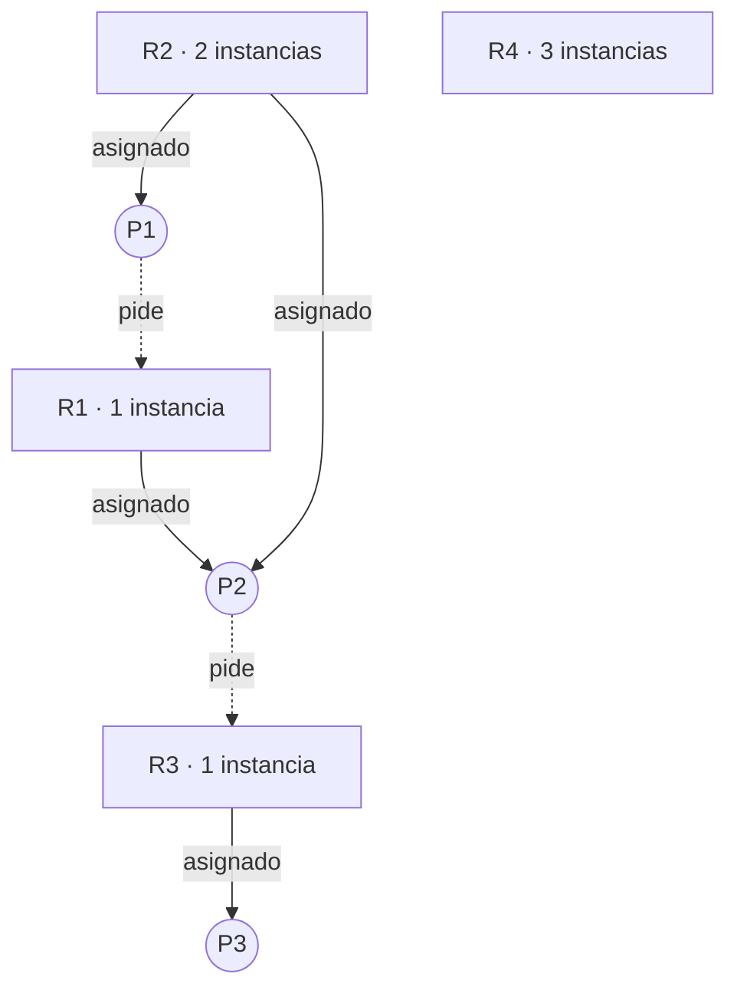
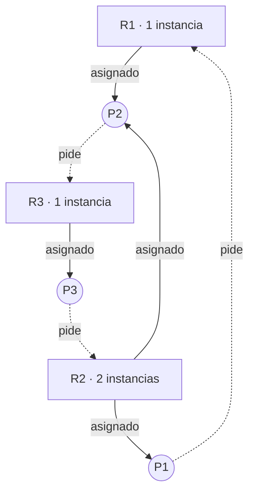

Un puente angosto por el que solo cabe un auto a la vez. Llega un auto por cada lado, los dos entran, y se encuentran en la mitad. Ninguno puede avanzar, y ninguno quiere retroceder. Así se quedan.

Eso es un **interbloqueo** (*deadlock*, o bloqueo mutuo): un conjunto de procesos donde **cada uno espera algo que solo puede darle otro proceso del mismo conjunto**. Como todos esperan, nadie avanza nunca. Ya lo vimos aparecer con los [semáforos](/archivo/sistemas-operativos/teoria/sincronizacion.md#como-se-puede-usar-mal) y con los [filósofos comensales](/archivo/sistemas-operativos/teoria/sincronizacion.md#los-filosofos-comensales).

## El modelo

Un sistema tiene **tipos de recursos** (R1, R2, ... Rm): tiempo de CPU, memoria, archivos, impresoras, cerrojos. Cada tipo puede tener varias **instancias** (dos impresoras iguales son dos instancias del mismo tipo).

Un proceso usa un recurso siempre en tres pasos:

1. **Pedirlo.** Si no está disponible, espera.
2. **Usarlo.**
3. **Liberarlo.**

Pedir y liberar son llamadas al sistema, o operaciones como `wait` y `signal` sobre un semáforo.

## Las cuatro condiciones

Un interbloqueo solo puede ocurrir si se dan **las cuatro** condiciones a la vez (se les llama condiciones de Coffman):

1. **Exclusión mutua:** al menos un recurso no se puede compartir; solo un proceso a la vez puede usarlo.
2. **Retener y esperar:** un proceso tiene al menos un recurso y espera conseguir otro, que tiene otro proceso.
3. **No expropiación:** un recurso no se le puede quitar a un proceso; solo lo suelta él, cuando termina de usarlo.
4. **Espera circular:** hay una cadena de procesos P0, P1, ..., Pn donde P0 espera algo que tiene P1, P1 espera algo que tiene P2, ..., y Pn espera algo que tiene P0.

En el puente: la sección del puente no se comparte (exclusión mutua), cada auto ocupa su mitad y espera la otra (retener y esperar), nadie puede sacar a un auto del puente (no expropiación), y cada uno espera al otro (espera circular).

Las condiciones no son del todo independientes: la espera circular implica que hay procesos reteniendo y esperando.

## El grafo de asignación de recursos

Un interbloqueo se puede ver con un **grafo**:

- los **procesos** son círculos;
- los **recursos** son rectángulos, con su cantidad de instancias;
- una flecha **de proceso a recurso** significa que el proceso **pide** ese recurso (y está esperando);
- una flecha **de recurso a proceso** significa que una instancia está **asignada** a ese proceso.

### Un grafo sin interbloqueo

- P1 tiene una instancia de R2 y pide R1.
- P2 tiene R1 y una instancia de R2, y pide R3.
- P3 tiene R3.



No hay ningún ciclo, así que no hay interbloqueo: P3 termina y libera R3, P2 lo toma, termina y libera R1, y P1 puede avanzar.

### Un grafo con interbloqueo

Lo mismo, pero ahora P3 también **pide** una instancia de R2:



Aparecen dos ciclos:

- P1 → R1 → P2 → R3 → P3 → R2 → P1
- P2 → R3 → P3 → R2 → P2

Las dos instancias de R2 las tienen P1 y P2, que están esperando. P3 espera R2, P2 espera a P3 y P1 espera a P2. Nadie puede avanzar: **interbloqueo**.

### Un ciclo no siempre es un interbloqueo

La regla general:

- **Sin ciclos**, no hay interbloqueo.
- **Con un ciclo**:
  - si cada recurso tiene **una sola instancia**, hay interbloqueo, seguro;
  - si hay recursos con **varias instancias**, **puede** haberlo, o no.

Por ejemplo, si P1 espera una instancia de un recurso que tiene dos, y la otra instancia la tiene un proceso P4 que no espera nada, cuando P4 termine la liberará y el ciclo se romperá solo.

## Qué hacer con los interbloqueos

Hay tres caminos:

1. **Asegurarse de que nunca ocurran**, ya sea **previniéndolos** (eliminando alguna de las cuatro condiciones) o **evitándolos** (decidiendo con cuidado cada asignación).
2. **Dejar que ocurran**, **detectarlos** y **recuperarse**.
3. **Ignorarlos** y hacer como que nunca pasan.

La tercera suena irresponsable, pero es lo que hacen la mayoría de los sistemas operativos de uso general, Linux y Windows incluidos, con los recursos de los programas: los interbloqueos son poco frecuentes, y prevenirlos o detectarlos siempre tiene un costo. Si un programa se traba, lo termina el usuario. (Se le llama, con cariño, el **algoritmo del avestruz**.) Los que sí se preocupan son el kernel por dentro, que evita los interbloqueos entre sus propios cerrojos, y las bases de datos.

## Prevención

Se trata de asegurar que **al menos una** de las cuatro condiciones nunca se cumpla.

**1. Exclusión mutua.** Los recursos que se pueden compartir, como un archivo de solo lectura, no la necesitan. Pero muchos recursos son intrínsecamente no compartibles (una impresora, un cerrojo), así que esta condición casi nunca se puede eliminar.

**2. Retener y esperar.** Hay que garantizar que un proceso que pide un recurso no tenga otros. Dos formas:

- que pida **todos** los recursos que va a necesitar **antes de empezar**;
- que solo pueda pedir recursos cuando **no tiene ninguno**, soltando los que tenía.

El problema: los recursos quedan tomados mucho tiempo sin usarse (baja utilización), y un proceso que necesita muchos recursos populares puede esperar para siempre (inanición).

**3. No expropiación.** Si un proceso pide un recurso que no está disponible, se le **quitan** todos los que tenía, y solo vuelve a correr cuando puede recuperarlos todos junto con el nuevo. Funciona con recursos cuyo estado se puede guardar y restaurar, como la CPU o la memoria, pero no con una impresora a mitad de un documento.

**4. Espera circular.** Se numeran todos los tipos de recursos, y los procesos **solo pueden pedirlos en orden creciente**. Si tienes R3, puedes pedir R5, pero no R1. Así es imposible formar un ciclo.

Esta última es la más usada en la práctica. Linux, por ejemplo, define un orden para sus cerrojos internos, y tiene una herramienta (`lockdep`) que avisa si algún código los toma en un orden que podría provocar un interbloqueo. En los [filósofos](/archivo/sistemas-operativos/teoria/sincronizacion.md#los-filosofos-comensales), que cada uno tome primero el tenedor de **número menor** es aplicar esta idea.

## Evitación

Prevenir es seguro pero restrictivo. **Evitar** es más flexible: el sistema permite todo, pero antes de cada asignación revisa si esa decisión podría llevar a un interbloqueo, y si es así, hace esperar al proceso.

Para eso necesita **información por adelantado**: la forma más simple es que cada proceso declare el **máximo** de recursos de cada tipo que podría llegar a pedir.

### Estado seguro

Un estado es **seguro** si existe una **secuencia segura**: un orden de todos los procesos, P1, P2, ..., Pn, en el que cada uno puede conseguir todo lo que le falta con lo que está disponible **más** lo que liberarán los que van antes que él en la secuencia.

La idea: aunque todos pidieran su máximo, habría una forma de atenderlos uno por uno, sin que nadie quede esperando para siempre.

- En un estado **seguro**, no hay interbloqueo.
- En un estado **no seguro**, **puede** haberlo (no necesariamente, pero el sistema ya no puede garantizar que no).
- **Evitar** es asegurarse de que el sistema **nunca pase a un estado no seguro**.

```plaintext
+-------------------------------------------+
|  estados posibles                         |
|                                           |
|   +-----------------+   +-------------+   |
|   |     seguros     |   | no seguros  |   |
|   |                 |   |  +--------+ |   |
|   |                 |   |  |deadlock| |   |
|   |                 |   |  +--------+ |   |
|   +-----------------+   +-------------+   |
+-------------------------------------------+
```

Por eso a veces un proceso tiene que esperar **aunque el recurso esté disponible**: si dárselo dejaría al sistema en un estado no seguro.

### El algoritmo del banquero

Dijkstra lo llamó así porque se parece a lo que hace un banco que da líneas de crédito: nunca presta dinero si, en el peor caso, no podría cubrir lo que todos sus clientes podrían pedir.

Se usan cuatro tablas, para `n` procesos y `m` tipos de recursos:

- **Disponible:** cuántas instancias de cada tipo están libres.
- **Máximo:** cuántas podría llegar a pedir cada proceso, como máximo.
- **Asignado:** cuántas tiene cada proceso ahora.
- **Necesita:** cuántas le faltan a cada proceso (Máximo − Asignado).

**Para saber si un estado es seguro:**

1. Partir con `trabajo = disponible` y todos los procesos sin terminar.
2. Buscar un proceso sin terminar cuyo **Necesita** quepa en `trabajo`. Si no hay ninguno, ir al paso 4.
3. Suponer que ese proceso termina y devuelve todo: `trabajo = trabajo + asignado`. Marcarlo como terminado y volver al paso 2.
4. Si todos quedaron terminados, el estado es **seguro**, y el orden en que se marcaron es una secuencia segura.

**Cuando un proceso pide recursos:**

1. Si pide más de lo que declaró como máximo: error.
2. Si pide más de lo disponible: espera.
3. Si no, **simular** que se le entregan, y revisar si el nuevo estado es seguro. Si lo es, se le entregan de verdad; si no, espera.

Este es el ejemplo clásico, con cinco procesos y tres tipos de recursos: A (10 instancias), B (5) y C (7). Cambia los datos y las solicitudes, y ejecuta:

```php
<?php
declare(strict_types=1);

// Algoritmo del banquero: ¿el estado es seguro? ¿se puede atender una solicitud?
// Tres tipos de recurso: A, B y C.

$disponible = [3, 3, 2];

$asignado = [          // lo que cada proceso tiene ahora
    'P0' => [0, 1, 0],
    'P1' => [2, 0, 0],
    'P2' => [3, 0, 2],
    'P3' => [2, 1, 1],
    'P4' => [0, 0, 2],
];

$maximo = [            // lo máximo que cada proceso declaró que podría pedir
    'P0' => [7, 5, 3],
    'P1' => [3, 2, 2],
    'P2' => [9, 0, 2],
    'P3' => [2, 2, 2],
    'P4' => [4, 3, 3],
];

// Solicitudes para probar: [proceso, [A, B, C]]
$solicitudes = [
    ['P1', [1, 0, 2]],
    ['P4', [3, 3, 0]],
    ['P0', [0, 2, 0]],
];

// ---------------------------------------------------------------------------

function restar(array $a, array $b): array { return array_map(fn($x, $y) => $x - $y, $a, $b); }
function sumar(array $a, array $b): array  { return array_map(fn($x, $y) => $x + $y, $a, $b); }
function cabe(array $a, array $b): bool    { return array_sum(array_map(fn($x, $y) => $x > $y ? 1 : 0, $a, $b)) === 0; }
function texto(array $v): string           { return '(' . implode(', ', $v) . ')'; }

// Devuelve una secuencia segura, o null si el estado no es seguro
function secuenciaSegura(array $disponible, array $asignado, array $maximo): ?array
{
    $trabajo = $disponible;
    $terminado = array_fill_keys(array_keys($asignado), false);
    $secuencia = [];

    do {
        $avanzo = false;
        foreach ($asignado as $p => $tiene) {
            $necesita = restar($maximo[$p], $tiene);
            if (!$terminado[$p] && cabe($necesita, $trabajo)) {
                // $p puede terminar y devolver todo lo que tiene
                $trabajo = sumar($trabajo, $tiene);
                $terminado[$p] = true;
                $secuencia[] = $p;
                $avanzo = true;
            }
        }
    } while ($avanzo);

    return in_array(false, $terminado, true) ? null : $secuencia;
}

$secuencia = secuenciaSegura($disponible, $asignado, $maximo);
echo "Disponible: ", texto($disponible), PHP_EOL;
echo $secuencia
    ? "Estado seguro. Secuencia segura: " . implode(' → ', $secuencia)
    : "Estado NO seguro";
echo PHP_EOL, PHP_EOL;

foreach ($solicitudes as [$p, $pide]) {
    echo "{$p} pide ", texto($pide), ": ";
    $necesita = restar($maximo[$p], $asignado[$p]);

    if (!cabe($pide, $necesita)) {
        echo "rechazada, pide más de lo que declaró como máximo", PHP_EOL;
        continue;
    }
    if (!cabe($pide, $disponible)) {
        echo "debe esperar, no hay recursos suficientes ahora", PHP_EOL;
        continue;
    }

    // Simular que se le entrega, y ver si el estado sigue siendo seguro
    $nuevoDisponible = restar($disponible, $pide);
    $nuevoAsignado = $asignado;
    $nuevoAsignado[$p] = sumar($asignado[$p], $pide);
    $sec = secuenciaSegura($nuevoDisponible, $nuevoAsignado, $maximo);

    if ($sec) {
        echo "se concede. Secuencia segura: ", implode(' → ', $sec), PHP_EOL;
        $disponible = $nuevoDisponible;   // se concede de verdad
        $asignado = $nuevoAsignado;
    } else {
        echo "debe esperar, concederla dejaría al sistema en un estado no seguro", PHP_EOL;
    }
}
```

La solicitud de P0 es interesante: hay recursos de sobra para entregarle `(0, 2, 0)`, y aun así tiene que esperar, porque después de dárselos no habría forma de asegurar que todos terminen.

El banquero funciona, pero casi no se usa en sistemas operativos reales: los procesos rara vez saben de antemano cuánto van a necesitar, y revisar el estado en cada solicitud es costoso.

## Detección y recuperación

Si no se previene ni se evita, hay que ser capaz de **darse cuenta** de que ocurrió un interbloqueo, y de **salir** de él.

### Detectar

- **Si cada recurso tiene una sola instancia**, basta con buscar ciclos en un **grafo de espera**: el grafo de asignación, pero solo con los procesos, donde una flecha de Pi a Pj significa "Pi espera algo que tiene Pj". Un ciclo es un interbloqueo.
- **Si hay varias instancias**, se usa un algoritmo parecido al del banquero, pero con lo que cada proceso está **pidiendo ahora** en vez de su máximo. Los procesos que no se pueden marcar como terminados están en interbloqueo.

¿Cada cuánto correr la detección? Si es muy seguido, es caro. Si es muy de vez en cuando, los procesos bloqueados pasan mucho tiempo sin avanzar, y ya no se puede saber qué solicitud causó el problema. Una opción razonable es correrla cuando la utilización de CPU baja de cierto nivel, que es un síntoma de que muchos procesos están esperando.

### Recuperarse

Hay que romper la espera circular. Dos formas:

**Terminar procesos:**

- **Todos los que están en el interbloqueo:** rápido, pero se pierde todo el trabajo que llevaban.
- **De a uno**, volviendo a correr la detección después de cada uno, hasta que el ciclo desaparezca. Pierde menos trabajo, pero es más lento. Hay que elegir a quién terminar: el que lleva menos tiempo, el que tiene menos recursos, el de menor prioridad.

**Expropiar recursos:** quitarles recursos a algunos procesos y dárselos a otros, hasta romper el ciclo. Hay que resolver tres cosas:

- **A quién:** elegir la víctima que cueste menos.
- **Retroceso** (*rollback*): el proceso al que se le quitó un recurso no puede seguir como si nada. Hay que devolverlo a un estado seguro anterior, y eso obliga a ir guardando el estado de los procesos.
- **Inanición:** si siempre se elige a la misma víctima, nunca termina. Hay que limitar cuántas veces puede ser elegido un proceso.

### Donde sí se hace: las bases de datos

Las bases de datos detectan interbloqueos todo el tiempo. Si dos transacciones se esperan entre sí para siempre, el motor lo detecta, elige una **víctima**, la aborta con un error y hace **rollback** de sus cambios. La otra sigue. La aplicación recibe el error y puede reintentar. PostgreSQL, MySQL y SQL Server funcionan así.

## Combinar estrategias

Ninguna estrategia sirve para todo. Una idea es dividir los recursos en **clases** ordenadas, lo que previene la espera circular **entre** clases, y aplicar dentro de cada clase la estrategia que mejor le calza:

| Clase de recurso | Ejemplo | Estrategia |
|---|---|---|
| Recursos internos del sistema | Bloques de control de proceso | Prevención por orden de recursos |
| Memoria principal | Memoria de un proceso | Prevención por expropiación (se puede llevar a disco) |
| Recursos de los trabajos | Dispositivos, archivos | Evitación (se conocen las necesidades) |
| Espacio de intercambio | Espacio en disco de cada trabajo | Asignar todo por adelantado (se conoce el máximo) |

## Ejercicios

<details>
<summary><span>¿Cuáles son las cuatro condiciones necesarias para un interbloqueo? ¿Basta con que se cumplan tres?</span></summary>

1. **Exclusión mutua:** hay recursos que no se pueden compartir.
2. **Retener y esperar:** un proceso tiene recursos y espera otros.
3. **No expropiación:** los recursos no se pueden quitar a la fuerza.
4. **Espera circular:** hay un ciclo de procesos donde cada uno espera algo del siguiente.

No basta con tres: tienen que cumplirse **las cuatro a la vez**. Por eso prevenir consiste en eliminar cualquiera de ellas.

</details>

<details>
<summary><span>Dos procesos necesitan escribir en dos archivos, A y B. P1 bloquea A y después intenta bloquear B; P2 bloquea B y después intenta bloquear A. ¿Qué puede pasar y cómo lo previenes?</span></summary>

Si P1 alcanza a bloquear A y P2 alcanza a bloquear B antes de que alguno pida el segundo, cada uno espera el archivo que tiene el otro: **interbloqueo**.

La prevención más simple es **ordenar los recursos**: que ambos procesos bloqueen siempre primero A y después B. Así, el que consiga A primero consigue también B, y el otro espera sin tener nada tomado. Se rompe la espera circular.

</details>

<details>
<summary><span>En un grafo de asignación de recursos hay un ciclo. ¿Hay interbloqueo?</span></summary>

Depende:

- Si **cada recurso del ciclo tiene una sola instancia**, sí, hay interbloqueo.
- Si algún recurso tiene **varias instancias**, puede haberlo o no: si alguna instancia la tiene un proceso fuera del ciclo que no está esperando nada, cuando termine la liberará y el ciclo se romperá.

Lo que sí es seguro es lo contrario: si **no hay ciclos**, no hay interbloqueo.

</details>

<details>
<summary><span>¿Qué diferencia hay entre prevenir y evitar un interbloqueo?</span></summary>

- **Prevenir** es imponer reglas generales que hacen **imposible** alguna de las cuatro condiciones (por ejemplo, pedir los recursos siempre en orden). No necesita información sobre los procesos, pero restringe lo que pueden hacer y suele desaprovechar recursos.
- **Evitar** es permitir cualquier secuencia de solicitudes, pero **revisar cada una** antes de concederla, y hacer esperar al proceso si concederla podría llevar a un interbloqueo. Aprovecha mejor los recursos, pero necesita saber de antemano cuánto podría pedir cada proceso.

</details>

<details>
<summary><span>Con los datos del simulador, después de concederle a P1 su solicitud, ¿por qué P0 no puede recibir (0, 2, 0) si hay suficientes recursos disponibles?</span></summary>

Después de atender a P1, quedan disponibles `(2, 3, 0)`. Si además se le entregan `(0, 2, 0)` a P0, quedarían `(2, 1, 0)`.

Con `(2, 1, 0)` no hay ningún proceso cuyo **Necesita** quepa: P1 necesita dos de B y solo quedaría una; P3 necesita una de C y no quedaría ninguna; P0, P2 y P4 necesitan más de A de lo que queda. Ninguno podría terminar con seguridad, así que no existe secuencia segura: el estado sería **no seguro**. Por eso P0 debe esperar, aunque los recursos que pide estén libres.

Puedes comprobarlo en el simulador, dejando solo la solicitud de P0 después de la de P1.

</details>

<details>
<summary><span>¿Por qué Linux y Windows, en general, no previenen ni detectan los interbloqueos de los programas?</span></summary>

Porque tiene un costo alto y el beneficio es bajo:

- **Prevenir** restringe mucho lo que pueden hacer los programas y desaprovecha recursos.
- **Evitar** exige saber de antemano cuánto va a pedir cada proceso, algo que casi nunca se sabe.
- **Detectar** consume tiempo de CPU en revisar constantemente el estado del sistema.

Los interbloqueos en programas son poco frecuentes, y cuando ocurren, el usuario o el administrador termina el proceso. Es el "algoritmo del avestruz". Donde sí importan, como dentro del propio kernel o en las bases de datos, sí se toman medidas.

</details>

<details>
<summary><span>Al recuperarse de un interbloqueo terminando procesos, ¿qué criterios usarías para elegir a cuál terminar?</span></summary>

Elegir el que **cueste menos**, considerando por ejemplo:

- el que lleva **menos tiempo** corriendo, o al que le falta más para terminar (se pierde menos trabajo);
- el que tiene **menos recursos** asignados, o el que tiene los que más se necesitan para romper el ciclo;
- el de **menor prioridad**;
- si es **interactivo o por lotes** (terminar uno interactivo molesta más a un usuario);
- que no haya sido **elegido muchas veces antes**, para no provocar inanición.

</details>

---

Vuelve al índice de **[Cómo funciona un sistema operativo](/archivo/sistemas-operativos/teoria/index.md)**.
