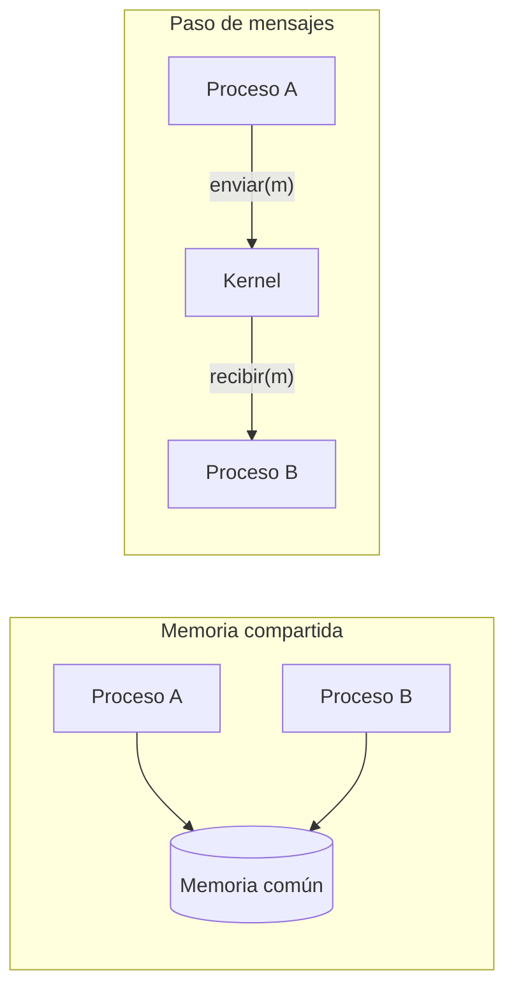

El **proceso** es la idea central de todo sistema operativo. Casi todo lo demás (planificación, memoria, sincronización) existe para crear, administrar y proteger procesos.

## Programa y proceso

Un **programa** es un archivo con instrucciones: algo **pasivo**, guardado en disco. Un **proceso** es un programa **en ejecución**: algo **activo**, con estado, que avanza instrucción por instrucción.

Un mismo programa puede estar corriendo varias veces: si abres tres terminales, hay tres procesos de `bash`, cada uno con sus propios datos.

(En los sistemas por lotes se hablaba de *trabajos* o *jobs*; hoy se usa *proceso*, pero la idea es la misma.)

### Qué tiene un proceso

Cada proceso tiene su propio **espacio de direcciones**, la memoria que puede usar, organizado en secciones:

```plaintext
 dirección alta +----------------+
                |      Pila      |  variables locales; crece hacia abajo
                |       v        |
                |                |
                |       ^        |
                |   Montículo    |  memoria dinámica; crece hacia arriba
                +----------------+
                |     Datos      |  variables globales
                +----------------+
                | Texto (código) |  las instrucciones del programa
 dirección baja +----------------+
```

Y además, su estado de ejecución: el **contador de programa** (qué instrucción viene), el contenido de los **registros** de la CPU, y los recursos que tiene asignados, como archivos abiertos.

## Estados de un proceso

Mientras vive, un proceso pasa por varios estados:

```plaintext
 +-------+       +-------+  elegido   +-----------+       +-----------+
 | Nuevo |------>| Listo |----------->| Ejecución |------>| Terminado |
 +-------+       +-------+            +-----------+  exit +-----------+
                  ^    ^  fin de turno   |     |
                  |    +-----------------+     |
                  |                            | espera E/S
                  |       +--------+           | o un evento
                  +-------| Espera |<----------+
       terminó la E/S     +--------+
       o llegó el evento
```

- **Nuevo:** se está creando.
- **Listo:** tiene todo lo necesario para correr, y espera que le toque el procesador.
- **Ejecución:** sus instrucciones se están ejecutando. En cada núcleo, **solo uno** puede estar en este estado a la vez.
- **Espera** (o bloqueado): no puede continuar hasta que ocurra algo, normalmente que termine una operación de E/S.
- **Terminado:** ya terminó.

Fíjate que de **Espera** no se vuelve directo a **Ejecución**: cuando el evento ocurre, el proceso pasa a **Listo** y espera su turno como todos.

En Linux, la columna `STAT` de [`ps aux`](/archivo/sistemas-operativos/linux/procesos-y-servicios.md#ver-los-procesos) muestra estos estados: `R` es listo o en ejecución, `S` y `D` son espera, `T` es detenido y `Z` es zombi (terminado, pero su padre aún no ha leído su resultado).

## El bloque de control de proceso

Para cada proceso, el sistema operativo guarda toda su información en una estructura llamada **PCB** (*Process Control Block*):

- el **estado** del proceso;
- el **contador de programa** y los **registros** de la CPU (guardados cuando no está corriendo);
- información de **planificación**: prioridad, tiempo de CPU usado;
- información de **memoria**: dónde está su espacio de direcciones;
- **contabilidad**: su identificador (PID), su dueño, cuánto tiempo lleva;
- **estado de E/S**: archivos abiertos, dispositivos asignados.

En Linux, el PCB es una estructura del kernel llamada `task_struct`, y mucha de su información se puede ver en `/proc/PID/status`.

## Colas y planificadores

El sistema operativo organiza los procesos en **colas**:

- **Cola de listos:** los procesos en memoria esperando el procesador.
- **Colas de dispositivos:** los procesos esperando a un dispositivo en particular; cada dispositivo tiene la suya.

Un proceso va pasando de una cola a otra durante su vida: está listo, le toca la CPU, pide leer del disco y se va a la cola del disco, termina la lectura y vuelve a la cola de listos.

Quién decide los movimientos son los **planificadores**:

| Planificador | Qué decide | Cada cuánto |
|---|---|---|
| **De corto plazo** (de CPU) | Qué proceso de la cola de listos se ejecuta ahora | Muy seguido (milisegundos): tiene que ser rapidísimo |
| **De mediano plazo** | Sacar temporalmente procesos de la memoria (al disco) cuando falta, y traerlos de vuelta | Cada tanto |
| **De largo plazo** (de trabajos) | Qué trabajos nuevos se admiten al sistema; controla cuántos procesos hay a la vez | Poco (segundos o minutos) |

En un computador personal casi no hay planificador de largo plazo: cuando abres un programa, se ejecuta. Donde sí se ve es en sistemas que reciben trabajos en cola, como los supercomputadores.

A los procesos se les suele clasificar en dos tipos, según cómo usan el tiempo:

- **Limitados por E/S:** pasan más tiempo esperando entrada y salida que calculando. Usan la CPU en ráfagas cortas. Un editor de texto, un navegador.
- **Limitados por CPU:** pasan la mayor parte del tiempo calculando, con ráfagas largas. Una compilación, un cálculo científico, codificar un video.

Un buen planificador mezcla ambos tipos para que el sistema se sienta ágil y aproveche el procesador. Cómo lo hace es el tema de planificación de CPU.

## Cambio de contexto

Cuando el procesador pasa de un proceso a otro, el sistema operativo tiene que:

1. **Guardar** el estado del proceso que sale (contador de programa, registros) en su PCB.
2. **Cargar** el estado del proceso que entra desde su PCB.

Esto se llama **cambio de contexto**, y es **tiempo perdido**: mientras ocurre, ningún proceso avanza. Por eso tiene que ser muy rápido (en hardware actual, del orden de los microsegundos), y por eso cambiar de proceso demasiado seguido también es malo.

En Linux se puede ver cuántos cambios de contexto ocurren por segundo en todo el sistema (columna `cs`), o los que ha tenido un proceso:

```bash
vmstat 1                                   # columna cs, cada segundo
grep ctxt_switches /proc/PID/status        # los de un proceso
```

## Crear y terminar procesos

### El árbol de procesos

Todo proceso es creado por otro, su **padre**, y los procesos que crea son sus **hijos**. Así se forma un árbol, con la raíz en el primer proceso: en Linux, `systemd`, con PID 1.

```bash
pstree -p
```

Al crear un hijo, hay varias decisiones de diseño:

- **Recursos:** padre e hijo pueden compartirlos todos, algunos o ninguno.
- **Ejecución:** el padre puede seguir corriendo a la par del hijo, o esperar a que termine.
- **Espacio de direcciones:** el hijo puede ser un duplicado del padre, o cargar un programa nuevo.

### `fork` y `exec` en UNIX

UNIX resuelve la creación con dos llamadas al sistema separadas:

- [`fork()`](https://man7.org/linux/man-pages/man2/fork.2.html) crea un hijo que es una **copia exacta** del padre. Los dos siguen ejecutando desde el mismo punto, y se distinguen por lo que devuelve `fork`: al padre, el PID del hijo; al hijo, un 0.
- [`exec()`](https://man7.org/linux/man-pages/man2/execve.2.html) **reemplaza** el programa del proceso actual por otro.
- [`wait()`](https://man7.org/linux/man-pages/man2/wait.2.html) hace que el padre espere a que un hijo termine, y recoja su código de salida.

Así funciona tu shell cada vez que escribes un comando: hace `fork`, el hijo hace `exec` del comando, y la shell espera con `wait`.

```c
#include <stdio.h>
#include <stdlib.h>
#include <unistd.h>
#include <sys/wait.h>

int main(void) {
    printf("Soy el padre, mi PID es %d\n", getpid());

    fflush(stdout);  // vacía el búfer antes de duplicar el proceso
    pid_t pid = fork();

    if (pid < 0) {
        perror("fork");
        exit(1);
    } else if (pid == 0) {
        // Esto lo ejecuta solo el hijo
        printf("Soy el hijo, mi PID es %d y mi padre es %d\n", getpid(), getppid());
        fflush(stdout);
        execlp("ls", "ls", "-l", "/tmp", (char *) NULL);
        perror("exec");  // solo se llega aquí si exec falló
        exit(1);
    } else {
        // Esto lo ejecuta solo el padre
        int estado;
        waitpid(pid, &estado, 0);
        printf("Mi hijo %d terminó con código %d\n", pid, WEXITSTATUS(estado));
    }
    return 0;
}
```

Para probarlo en Linux: guárdalo como `fork.c`, compílalo con `gcc -o fork fork.c` y ejecútalo con `./fork`.

¿Por qué los `fflush`? `printf` no siempre escribe de inmediato: a veces acumula el texto en un búfer, dentro de la memoria del proceso. Sin el primero, `fork` copiaría ese búfer con el mensaje del padre todavía pendiente, y si el hijo terminara sin hacer `exec`, el mensaje saldría dos veces. Sin el segundo, `exec` reemplazaría el programa del hijo antes de escribir su mensaje, y se perdería. Un buen ejemplo de que después de `fork` los procesos son independientes de verdad, búferes incluidos.

### Terminar

Un proceso termina cuando:

- **Ejecuta su última instrucción** y le pide al sistema operativo que lo elimine, con [`exit`](/archivo/sistemas-operativos/linux/procesos-y-servicios.md). Devuelve un **código de salida** (0 si todo salió bien) que el padre recoge con `wait`. En la terminal, `echo $?` muestra el del último comando.
- **Otro proceso lo termina**, normalmente su padre, porque el hijo excedió sus recursos, porque su tarea ya no se necesita o porque el padre mismo está terminando. En Linux, esto se hace enviando una [señal](/archivo/sistemas-operativos/linux/procesos-y-servicios.md#senales).

Al terminar, el sistema operativo libera todos sus recursos.

Dos situaciones especiales:

- **Zombi:** el hijo terminó, pero su padre todavía no llamó a `wait`. El proceso ya no corre, pero su entrada sigue existiendo para guardar el código de salida.
- **Huérfano:** el padre terminó antes que el hijo. Algunos sistemas terminan a todos los hijos **en cascada**. En Linux no: el huérfano sigue corriendo, y lo **adopta** PID 1 o un proceso designado para eso (por ejemplo, el `systemd` de tu sesión de usuario).

## Procesos cooperativos

- Un proceso **independiente** no afecta ni es afectado por otros.
- Un proceso **cooperativo** puede afectar o ser afectado por otros, porque comparten datos o se comunican.

¿Para qué cooperar?

- **Compartir información** entre varias partes de un sistema.
- **Velocidad:** dividir una tarea en partes que corren en paralelo, en varios núcleos.
- **Modularidad:** construir un sistema grande a partir de piezas separadas.
- **Conveniencia:** hacer varias cosas a la vez, como editar mientras se compila.

El ejemplo clásico de cooperación es el **productor y el consumidor**: un proceso produce datos (un servidor web que recibe solicitudes) y otro los consume (el que las atiende). Lo vemos más abajo, simulado.

## Hilos

Un **hilo** (*thread*, o hebra) es la unidad básica de uso de la CPU **dentro** de un proceso. Cada hilo tiene lo suyo:

- su contador de programa;
- sus registros;
- su pila.

Y **comparte** con los demás hilos del mismo proceso:

- el código;
- los datos;
- los recursos del sistema operativo, como los archivos abiertos.

Un proceso tradicional tiene un solo hilo. Un proceso **multihilo** puede hacer varias cosas a la vez: un navegador tiene un hilo dibujando la página, otro descargando imágenes y otro atendiendo lo que escribes.

```plaintext
     Proceso con un hilo              Proceso con tres hilos
   +--------------------------+    +--------------------------+
   |código | datos | archivos |    |código | datos | archivos |
   +--------------------------+    +--------+--------+--------+
   |     registros | pila     |    |regist. |regist. |regist. |
   |                          |    |  pila  |  pila  |  pila  |
   |          ~ hilo          |    |   ~    |   ~    |   ~    |
   +--------------------------+    +--------+--------+--------+
```

**Ventajas frente a usar varios procesos:**

- **Crear un hilo es mucho más barato** que crear un proceso, y cambiar de hilo también.
- **Comparten memoria directamente**, así que comunicarse es trivial.
- Si un hilo se **bloquea** esperando E/S, los demás siguen trabajando.
- En un procesador con varios núcleos, los hilos corren **en paralelo**.

El costo de compartir memoria es que dos hilos pueden **pisarse** al modificar los mismos datos. Es el problema de la sincronización, que tiene su propio tema, y que en PHP se ve en la unidad de [Concurrencia y asincronía](/ramos/programacion-avanzada/unidades/03-concurrencia-y-asincronia/index.md) de Programación Avanzada.

### Hilos de usuario y de kernel

- **Hilos de kernel:** el sistema operativo los conoce y los planifica. Si uno se bloquea, los demás siguen.
- **Hilos de usuario:** los maneja una biblioteca dentro del proceso, sin que el kernel se entere. Son más livianos, pero si uno hace una llamada que bloquea, puede bloquear al proceso completo.

Linux usa un modelo **1:1**: cada hilo de usuario es un hilo del kernel. Otros lenguajes, como Go, usan un modelo **M:N**, con muchos hilos livianos repartidos sobre unos pocos hilos del kernel.

```bash
ps -eLf | head            # una línea por hilo (columna LWP)
ps -o nlwp= -p PID        # cuántos hilos tiene un proceso
```

## Comunicación entre procesos

Los procesos cooperativos necesitan comunicarse. El sistema operativo ofrece mecanismos de **IPC** (*Inter-Process Communication*), que siguen dos modelos, y un mismo sistema puede usar ambos:



- **Memoria compartida:** los procesos acuerdan una zona de memoria que ambos pueden leer y escribir. Es muy rápida, porque después de configurarla el kernel no interviene, pero los procesos tienen que coordinarse para no pisarse.
- **Paso de mensajes:** los procesos se envían mensajes a través del sistema operativo, con dos operaciones básicas: `enviar(mensaje)` y `recibir(mensaje)`. Es más lento, pero no hay datos compartidos que proteger, y funciona igual entre procesos de distintos computadores.

### Decisiones de diseño del paso de mensajes

**Comunicación directa o indirecta:**

- **Directa:** cada proceso nombra explícitamente al otro: `enviar(P, mensaje)`, `recibir(Q, mensaje)`. Hay un enlace por cada par de procesos. El problema: si cambia el nombre de un proceso, hay que cambiarlo en todos los que lo nombran. (Si solo el que envía nombra al destinatario, y el que recibe acepta de cualquiera, se dice que es **asimétrica**.)
- **Indirecta:** los mensajes se envían a **buzones** (*mailboxes*), que tienen su propio identificador: `enviar(A, mensaje)`, `recibir(A, mensaje)`. Varios procesos pueden compartir un buzón. Si varios reciben del mismo, hay que decidir quién se lleva cada mensaje: que solo uno pueda recibir a la vez, o que el sistema elija y le avise al emisor.

**Sincronía:**

- **Bloqueante** (sincrónico): `enviar` espera a que el mensaje sea recibido, y `recibir` espera a que llegue un mensaje.
- **No bloqueante** (asincrónico): las operaciones vuelven de inmediato, haya o no mensaje.

**Capacidad del búfer** (la cola de mensajes del enlace):

- **Capacidad cero:** no hay cola. El emisor tiene que esperar a que el receptor tome el mensaje: se encuentran (*rendezvous*).
- **Capacidad limitada:** una cola de *n* mensajes. Si está llena, el emisor espera.
- **Capacidad ilimitada:** el emisor nunca espera (en teoría: la memoria siempre tiene un límite).

**Mensajes perdidos:** en una red, un mensaje se puede perder o alterar. O el sistema operativo lo detecta y lo retransmite, o le avisa al emisor para que decida qué hacer. Por eso existen los **acuses de recibo**, que es lo que hace TCP.

### Productor y consumidor, simulado

Esta simulación muestra un productor y un consumidor que se comunican por un **búfer de capacidad limitada**. No son procesos reales: cada paso de la lista dice quién intenta actuar. Cambia la capacidad o el orden de los pasos, y mira cuándo se bloquea cada uno.

```php
<?php
declare(strict_types=1);

// Productor y consumidor con un búfer de capacidad limitada.
// No hay procesos reales: cada paso dice quién intenta actuar.

$capacidad = 3;
$bufer = new SplQueue();
$producidos = 0;

// P = el productor intenta producir, C = el consumidor intenta consumir
$pasos = ['P', 'P', 'P', 'P', 'C', 'P', 'C', 'C', 'C', 'C', 'P', 'C'];

foreach ($pasos as $i => $quien) {
    $numero = str_pad((string) ($i + 1), 2, ' ', STR_PAD_LEFT);

    if ($quien === 'P') {
        if (count($bufer) === $capacidad) {
            echo "{$numero}. Productor: búfer lleno, se bloquea y espera", PHP_EOL;
            continue;
        }
        $producidos++;
        $bufer->enqueue("elemento {$producidos}");
        echo "{$numero}. Productor: agrega elemento {$producidos}", PHP_EOL;
    } else {
        if ($bufer->isEmpty()) {
            echo "{$numero}. Consumidor: búfer vacío, se bloquea y espera", PHP_EOL;
            continue;
        }
        echo "{$numero}. Consumidor: saca ", $bufer->dequeue(), PHP_EOL;
    }

    echo "    búfer: [", implode(', ', iterator_to_array($bufer)), "] ",
         count($bufer), "/{$capacidad}", PHP_EOL;
}
```

El búfer es una [cola](/ramos/programacion-avanzada/unidades/01-estructuras-de-datos-y-algoritmos/pilas-y-colas.md): lo primero que se produce es lo primero que se consume. Prueba con `$capacidad = 0`: el productor nunca puede dejar nada, porque no hay dónde. Con capacidad cero, en un sistema real, productor y consumidor tendrían que encontrarse en el mismo instante.

### En Linux

| Mecanismo | Modelo | Para qué |
|---|---|---|
| **Tuberías** (`\|`) | Mensajes | Conectar la salida de un proceso con la entrada de otro, como en [la terminal](/archivo/sistemas-operativos/linux/redireccion-y-tuberias.md#tuberias-conectar-comandos) |
| **Tuberías con nombre** (`mkfifo`) | Mensajes | Lo mismo, entre procesos que no son parientes |
| **Sockets** | Mensajes | Comunicación en el mismo equipo o por la red |
| **Señales** | Mensajes (muy simples) | [Avisos](/archivo/sistemas-operativos/linux/procesos-y-servicios.md#senales) como "termina" o "recarga la configuración" |
| **Memoria compartida** (`mmap`, `shm_open`) | Memoria compartida | Compartir grandes volúmenes de datos rápido |

Más detalles en [`man 7 pipe`](https://man7.org/linux/man-pages/man7/pipe.7.html), y en los capítulos de procesos de [OSTEP](https://pages.cs.wisc.edu/~remzi/OSTEP/cpu-intro.pdf).

## Ejercicios

<details>
<summary><span>¿Qué diferencia hay entre un programa y un proceso?</span></summary>

Un **programa** es un archivo con instrucciones, guardado en disco: algo pasivo. Un **proceso** es un programa en ejecución: algo activo, con su espacio de memoria (código, datos, montículo, pila), su contador de programa, sus registros y sus recursos. Un mismo programa puede dar origen a muchos procesos a la vez.

</details>

<details>
<summary><span>Un proceso en ejecución pide leer un archivo del disco. ¿Por qué estados pasa hasta volver a ejecutarse?</span></summary>

1. **Ejecución → Espera:** pide la lectura y no puede seguir hasta tener los datos.
2. **Espera → Listo:** el disco termina y genera una interrupción; el proceso ya puede continuar.
3. **Listo → Ejecución:** cuando el planificador lo elige de nuevo.

No vuelve directo de Espera a Ejecución: tiene que esperar su turno en la cola de listos.

</details>

<details>
<summary><span>¿Qué es un cambio de contexto y por qué se dice que es tiempo perdido?</span></summary>

Es el paso del procesador de un proceso a otro: guardar el estado del que sale (contador de programa y registros) en su PCB, y cargar el del que entra desde el suyo.

Es tiempo perdido porque, mientras ocurre, **ningún proceso avanza**: el sistema solo está haciendo trámites. Por eso tiene que ser rápido, y por eso cambiar de proceso con demasiada frecuencia hace que el sistema rinda menos.

</details>

<details>
<summary><span>Clasifica como limitado por E/S o por CPU: un editor de texto, la compilación del kernel, un servidor de chat y la codificación de un video.</span></summary>

- **Editor de texto:** limitado por **E/S**. Pasa casi todo el tiempo esperando que escribas.
- **Compilación del kernel:** limitado por **CPU**. Calcula durante mucho tiempo seguido.
- **Servidor de chat:** limitado por **E/S**. Espera mensajes de la red y los reenvía, calculando muy poco.
- **Codificación de video:** limitado por **CPU**. Procesa cuadro tras cuadro.

</details>

<details>
<summary><span>En el ejemplo en C, ¿qué valor devuelve <code>fork()</code> y por qué el mismo código hace dos cosas distintas?</span></summary>

`fork()` devuelve un valor **distinto en cada proceso**:

- en el **padre**, devuelve el PID del hijo recién creado (un número positivo);
- en el **hijo**, devuelve 0;
- si falla, devuelve -1 (en el padre, porque no hubo hijo).

Después de `fork()` hay dos procesos ejecutando **el mismo código**, desde el mismo punto. El `if` sobre el valor devuelto es lo que hace que cada uno tome un camino distinto.

</details>

<details>
<summary><span>¿Qué es un proceso zombi? ¿Y uno huérfano?</span></summary>

- **Zombi:** un proceso que **ya terminó**, pero cuyo padre todavía no ha recogido su código de salida con `wait`. No usa CPU ni memoria, pero su entrada sigue ocupando un lugar en la tabla de procesos. En `ps` aparece con estado `Z`.
- **Huérfano:** un proceso que **sigue corriendo**, pero cuyo padre ya terminó. En Linux lo adopta PID 1, o un proceso designado para eso, que se encargará de recoger su código de salida cuando termine.

</details>

<details>
<summary><span>¿Qué comparten los hilos de un mismo proceso y qué tiene cada uno? ¿Por qué eso es a la vez una ventaja y un riesgo?</span></summary>

**Comparten** el código, los datos y los recursos, como los archivos abiertos. **Cada uno tiene** su contador de programa, sus registros y su pila.

- **Ventaja:** comunicarse es tan simple como leer y escribir la misma variable, y crear hilos o cambiar entre ellos es barato.
- **Riesgo:** si dos hilos modifican los mismos datos al mismo tiempo, se pueden pisar y dejar los datos inconsistentes. Hay que sincronizarlos.

</details>

<details>
<summary><span>¿Cuándo conviene memoria compartida y cuándo paso de mensajes?</span></summary>

- **Memoria compartida:** cuando los procesos están **en el mismo equipo** y necesitan intercambiar **muchos datos** rápido, como un servidor de video que pasa cuadros a un codificador. A cambio, hay que sincronizar el acceso.
- **Paso de mensajes:** cuando los datos son **pocos**, cuando se quiere evitar compartir datos (y sus problemas de sincronización), o cuando los procesos pueden estar **en distintos computadores**. Es más simple de usar correctamente, pero más lento.

</details>

<details>
<summary><span>En el paso de mensajes, ¿qué pasa con un emisor si el búfer tiene capacidad cero, limitada o ilimitada?</span></summary>

- **Capacidad cero:** el emisor siempre espera a que el receptor tome el mensaje. Ambos tienen que encontrarse (*rendezvous*).
- **Capacidad limitada:** el emisor solo espera si la cola está llena; si no, deja el mensaje y sigue.
- **Capacidad ilimitada:** el emisor nunca espera.

En la simulación del productor y el consumidor, esto se ve cuando el productor encuentra el búfer lleno y se bloquea.

</details>

---

Vuelve al índice de **[Cómo funciona un sistema operativo](/archivo/sistemas-operativos/teoria/index.md)**.
