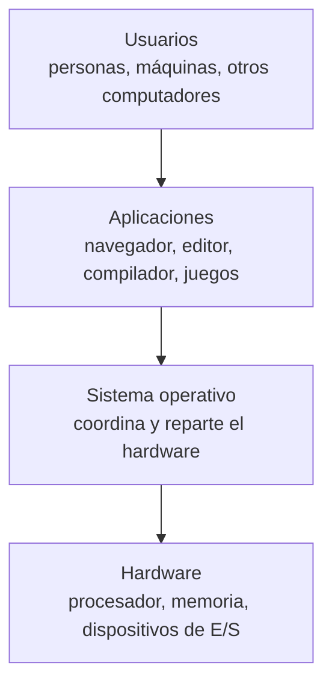

Todo el mundo usa uno, pocos saben decir qué es exactamente. Partamos por ahí.

## Las piezas de un sistema computacional

Un sistema computacional se puede ver en cuatro capas:



- El **hardware** pone los recursos básicos: capacidad de cálculo, memoria y dispositivos.
- Las **aplicaciones** usan esos recursos para resolver los problemas de los usuarios.
- El **sistema operativo** está en medio: controla el hardware y coordina su uso entre muchas aplicaciones y usuarios a la vez.

## Entonces, ¿qué es?

No hay una definición única y perfecta, pero estas tres miradas se complementan:

- **Un intermediario** entre los programas y el hardware. Ningún programa tiene que saber cómo se habla con un modelo específico de disco o de tarjeta de red: le pide al sistema operativo que lea un archivo o que envíe datos, y él se encarga.
- **Un administrador de recursos.** Hay un procesador (o unos pocos núcleos), una cantidad fija de memoria y un disco, y cientos de programas que los quieren al mismo tiempo. El sistema operativo decide quién usa qué, cuándo y cuánto.
- **Un programa de control**, que vigila la ejecución de los programas y evita que uno defectuoso o malicioso afecte a los demás.

Al programa que está corriendo **todo el tiempo**, con control total del hardware, se le llama **kernel** o núcleo. Todo lo demás son programas que corren encima.

El sistema operativo tiene dos objetivos que a veces tiran para lados opuestos:

1. **Conveniencia:** que usar el computador y escribir programas sea fácil.
2. **Eficiencia:** aprovechar el hardware lo mejor posible.

Un sistema operativo de teléfono se inclina hacia la conveniencia y el ahorro de batería; uno de un servidor que atiende millones de solicitudes, hacia la eficiencia.

### Tres grandes ideas

El libro [*Operating Systems: Three Easy Pieces*](https://pages.cs.wisc.edu/~remzi/OSTEP/intro.pdf) resume todo lo que hace un sistema operativo en tres ideas, que recorren el resto de estos temas:

- **Virtualización.** Hace que un recurso físico parezca muchos, o parezca más grande. Cada programa cree que tiene el procesador y toda la memoria para él solo.
- **Concurrencia.** Muchas cosas pasando al mismo tiempo, sin que se pisen.
- **Persistencia.** Que los datos sobrevivan aunque se apague el equipo.

## Espacio de usuario y espacio del núcleo

Los programas no pueden tocar el hardware directamente. Viven en el **espacio de usuario**, con permisos limitados. Cuando necesitan algo que solo el sistema operativo puede hacer (leer un archivo, abrir una conexión, crear un proceso), le piden ese servicio a través de una puerta bien definida: las **llamadas al sistema**.

```plaintext
   Aplicación    Aplicación    Aplicación         espacio de usuario
 ---------------------------------------------
         Interfaz de llamadas al sistema
 ---------------------------------------------
   Componentes del sistema operativo              espacio del núcleo
```

Cómo funciona esa puerta, y por qué el hardware tiene que ayudar a que nadie se la salte, lo vemos en [El computador por dentro](/archivo/sistemas-operativos/teoria/el-computador-por-dentro.md) y en [Estructura del sistema operativo](/archivo/sistemas-operativos/teoria/estructura-del-sistema.md).

## Cómo llegamos hasta aquí

Los sistemas operativos no se diseñaron de una vez: cada época resolvió el problema más caro que tenía.

### Los 40 y 50: la máquina desnuda y el procesamiento por lotes

Los primeros computadores no tenían sistema operativo. Eran máquinas enormes que se operaban desde una consola, de a una persona a la vez, que era programador, operador y usuario. Los programas entraban en cinta de papel o tarjetas perforadas. Preparar cada ejecución tomaba mucho tiempo, y mientras tanto el carísimo procesador estaba sin hacer nada.

La primera mejora fue separar al usuario del operador y agrupar trabajos parecidos en **lotes** (*batch*). Un pequeño programa, el **monitor residente**, se quedaba en memoria y pasaba automáticamente de un trabajo al siguiente: el antepasado de los sistemas operativos.

Pero los lectores de tarjetas y las impresoras eran lentísimos comparados con el procesador. La solución fue el **spooling** (*Simultaneous Peripheral Operation On-Line*): usar el disco como intermediario. Los trabajos se leían a disco antes de ejecutarse, y las impresiones se escribían en disco para salir por la impresora cuando se pudiera. El procesador ya no esperaba al dispositivo lento. Tu cola de impresión sigue funcionando así.

### Los 60: multiprogramación y tiempo compartido

La **multiprogramación** carga varios trabajos en memoria a la vez. Cuando uno se queda esperando un dispositivo, el procesador pasa a otro en vez de quedarse ocioso. Esto obligó al sistema operativo a hacer tres cosas nuevas:

- administrar la memoria entre varios programas;
- elegir qué trabajo usa el procesador (planificación);
- proteger a unos trabajos de otros.

En 1964, IBM lanzó la familia **System/360**, con un mismo sistema operativo para computadores de distintos tamaños.

Luego vino el **tiempo compartido** (*time sharing*): el procesador cambia de un usuario a otro tan rápido que cada uno, sentado en su terminal, siente que tiene el computador para él. Sistemas como CTSS (1961) y **MULTICS** (1965) introdujeron ideas que seguimos usando, como la memoria virtual y los sistemas de archivos jerárquicos. En 1969 nace **ARPANET**, la red que daría origen a internet.

### Los 70: UNIX y las redes

En 1969, en los Laboratorios Bell, nace **UNIX**, inspirado en MULTICS pero mucho más simple. En 1973 se reescribe en C y se vuelve portable a muchas máquinas. Se desarrolla también **TCP/IP**, que en 1983 pasa a ser el protocolo de ARPANET.

### Los 80: el computador personal

Los computadores bajan de precio y llegan a oficinas y casas: el IBM PC (1981), con MS-DOS, y la Macintosh (1984), que popularizó la **interfaz gráfica**. El sistema operativo ahora apunta a la **conveniencia** de una sola persona. Las redes locales se vuelven comunes, y aparece el modelo **cliente-servidor**. En 1989, en el CERN, Tim Berners-Lee propone la **World Wide Web**.

### Los 90: internet para todos y el software libre

El hardware se vuelve potente y barato, y el soporte de red pasa a ser estándar en todo sistema operativo. Windows domina los escritorios. Aparece **Linux** (1991) y, junto con el proyecto GNU y el servidor web Apache, el **software libre y de código abierto** se vuelve una alternativa real. Llega también el *plug and play*: conectar un dispositivo y que el sistema lo configure solo.

### 2000 en adelante: móviles, nube y contenedores

- **Varios núcleos en todas partes.** Desde mediados de los 2000, los procesadores dejan de volverse mucho más rápidos y, en cambio, traen varios núcleos. La concurrencia deja de ser un tema de servidores.
- **Móviles.** El iPhone (2007) y Android (2008) ponen un sistema operativo completo en el bolsillo, con prioridades nuevas: batería, pantalla táctil, permisos por aplicación.
- **Virtualización y nube.** Un servidor físico corre muchas máquinas virtuales, y se arriendan por hora (Amazon EC2, 2006).
- **Contenedores.** Aplicaciones empaquetadas con todo lo que necesitan, aisladas pero compartiendo el mismo núcleo (Docker, 2013).
- **Sistemas embebidos** en autos, electrodomésticos, relojes y routers, muchos con Linux por dentro.

## Tipos de sistemas

### Multiprocesador

Varios procesadores (o núcleos) que **comparten la memoria y el reloj**, en estrecha comunicación. Se dice que están *fuertemente acoplados*. Ventajas: más trabajo por unidad de tiempo, más barato que varias máquinas separadas y, si un procesador falla, el sistema puede seguir funcionando más lento.

- **Multiprocesamiento simétrico (SMP):** todos los procesadores son iguales y cualquiera puede ejecutar cualquier cosa, incluido el sistema operativo. Es lo que hacen hoy Linux, Windows y macOS.
- **Multiprocesamiento asimétrico:** cada procesador tiene una tarea asignada, y uno principal reparte el trabajo.

Los procesadores actuales de teléfonos y de muchos computadores mezclan núcleos **de alto rendimiento** y **de bajo consumo**. El sistema operativo tiene que decidir qué va a cada tipo: un poco de cada modelo.

### Distribuidos

Varios computadores **que no comparten memoria ni reloj**, conectados por una red: *débilmente acoplados*. Permiten compartir recursos, repartir la carga, seguir funcionando si uno falla y comunicarse.

- En un **sistema operativo de red**, cada máquina es independiente y comparte archivos o servicios con las demás.
- En un **sistema distribuido** propiamente tal, el conjunto da la impresión de ser un solo sistema.

Los *clusters* y los servicios en la nube son sistemas distribuidos.

### De tiempo real

Sistemas donde **responder a tiempo es parte de responder bien**. Una respuesta correcta que llega tarde es una respuesta incorrecta.

- **Tiempo real duro (*hard*):** los plazos no se pueden incumplir nunca. Los frenos ABS de un auto, un marcapasos, el control de un avión. Suelen usar sistemas operativos especializados, como FreeRTOS o Zephyr.
- **Tiempo real blando (*soft*):** incumplir un plazo degrada el servicio, pero no es catastrófico. Una videollamada que se entrecorta, un juego que baja de cuadros.

Desde 2024, el kernel Linux incluye oficialmente el soporte `PREEMPT_RT`, que le permite atender aplicaciones de tiempo real.

## Generaciones de computadores

| Generación | Época | Tecnología |
|---|---|---|
| 0 | hasta 1945 | Mecánicas y electromecánicas |
| 1 | 1945–1955 | Tubos de vacío |
| 2 | 1955–1965 | Transistores |
| 3 | 1965–1980 | Circuitos integrados |
| 4 | 1980 en adelante | Microprocesadores (VLSI): millones y luego miles de millones de transistores en un chip |

## Ejercicios

<details>
<summary><span>¿Cuáles son los dos objetivos de un sistema operativo, y por qué a veces se contraponen?</span></summary>

**Conveniencia**, que el sistema sea fácil de usar y de programar, y **eficiencia**, que aproveche bien el hardware.

Se contraponen porque lo cómodo suele costar recursos. Una interfaz gráfica con animaciones es conveniente pero consume procesador y memoria. Revisar cada operación para proteger al usuario de errores lo hace más seguro pero más lento. Cada sistema elige su punto de equilibrio según para qué se usa.

</details>

<details>
<summary><span>¿Qué problema resolvió el spooling, y dónde lo sigues viendo hoy?</span></summary>

La enorme diferencia de velocidad entre el procesador y los dispositivos de entrada y salida, como lectores de tarjetas e impresoras. En vez de que el procesador espere al dispositivo, los datos se dejan en disco y el dispositivo los procesa a su ritmo.

Hoy lo ves en la **cola de impresión**: mandas tres documentos a imprimir, sigues trabajando, y la impresora los va sacando de a uno.

</details>

<details>
<summary><span>¿Qué diferencia hay entre multiprogramación y tiempo compartido?</span></summary>

La **multiprogramación** mantiene varios trabajos en memoria y cambia de uno a otro **cuando el que está corriendo se queda esperando** (por ejemplo, un dispositivo). Su objetivo es que el procesador no esté ocioso.

El **tiempo compartido** va más allá: cambia de un trabajo a otro **muy seguido, aunque ninguno esté esperando**, para que muchos usuarios interactúen al mismo tiempo y cada uno sienta que el computador responde de inmediato. Su objetivo es el tiempo de respuesta.

</details>

<details>
<summary><span>¿En qué se diferencia un sistema multiprocesador de uno distribuido?</span></summary>

En un sistema **multiprocesador**, los procesadores comparten la memoria y el reloj, y se comunican a través de esa memoria compartida: están fuertemente acoplados.

En uno **distribuido**, cada computador tiene su propia memoria y su propio reloj, y se comunican enviándose mensajes por una red: están débilmente acoplados.

</details>

<details>
<summary><span>¿El control de frenos de un auto y una plataforma de streaming de video son sistemas de tiempo real? ¿De qué tipo?</span></summary>

Los dos lo son, pero de distinto tipo:

- **Los frenos** son de tiempo real **duro**: si la respuesta llega tarde, puede haber un accidente. No se admite incumplir un plazo.
- **El streaming** es de tiempo real **blando**: si un cuadro llega tarde, el video se entrecorta o baja de calidad, pero nada grave pasa.

</details>

---

Sigue con **[El computador por dentro](/archivo/sistemas-operativos/teoria/el-computador-por-dentro.md)**.
